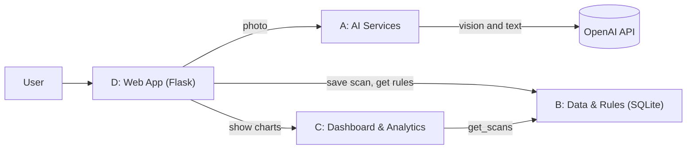
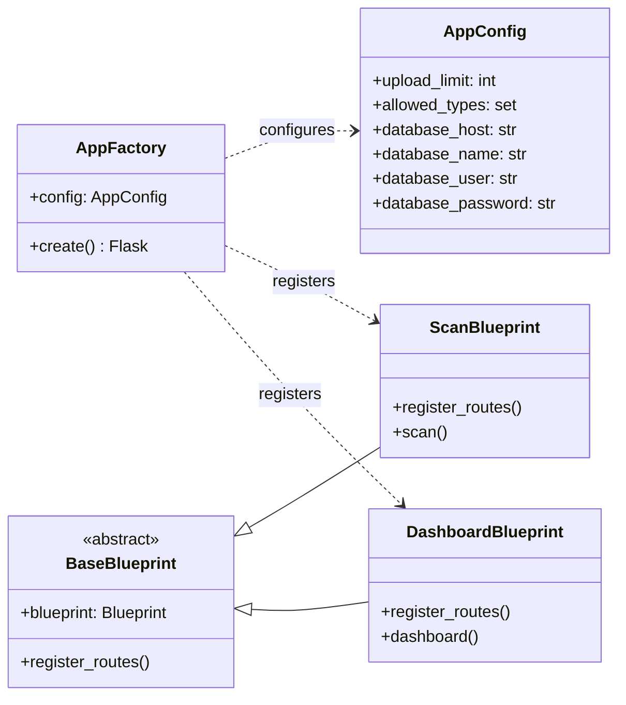
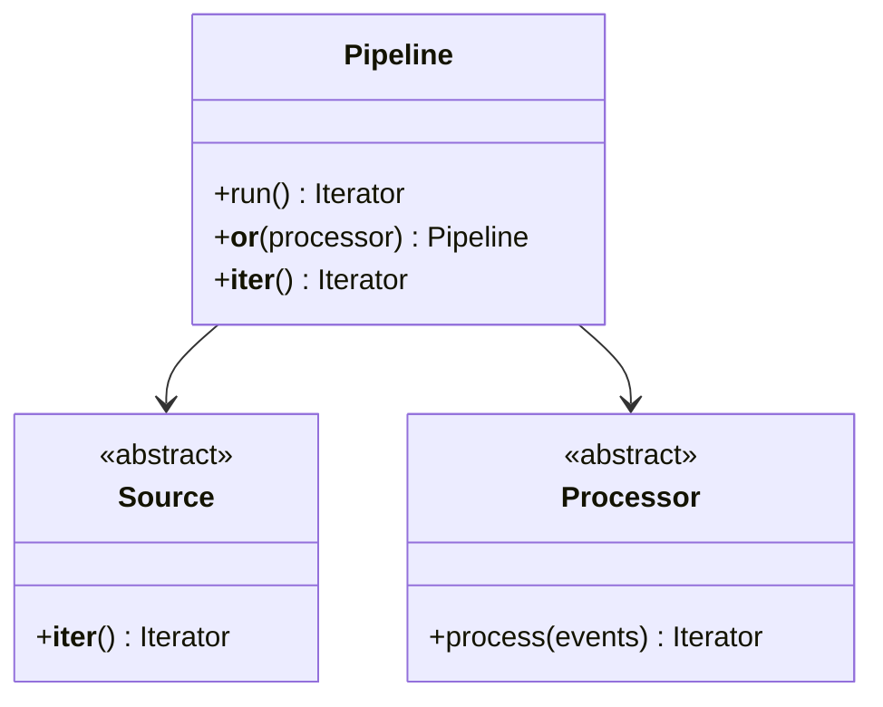
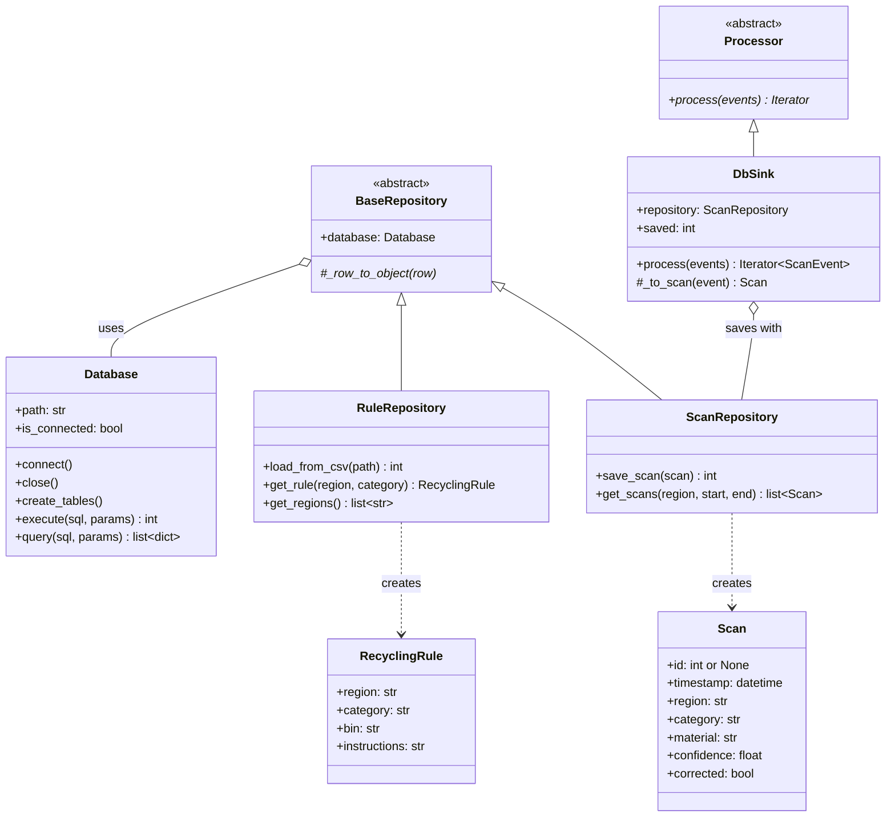
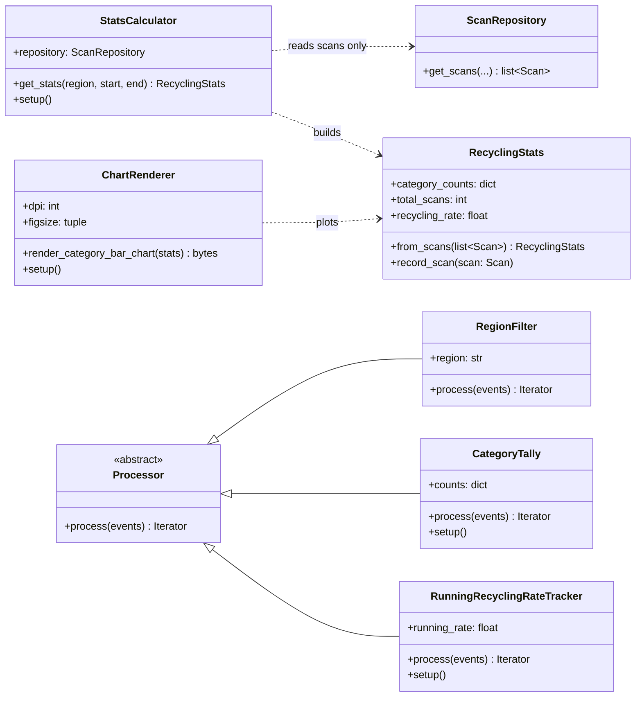

# AI-Powered Waste Sorting & Recycling Assistant

Photo-based household waste classification with region-specific disposal rules and recycling-rate analytics.

Capstone project, Compact Programming Course (Python), FH Dortmund, WS 2026/27.

**Problem:** people don't know which bin an item belongs in, and municipalities don't know their recycling rates.

## Team

| Member | Subsystem | Files |
|---|---|---|
| Oluwatimilehin Ogunme | A · AI Services | `ai_services.py` |
| Terkuma Caleb Lumun | B · Data & Rules | `db.py`, `schema.sql`, `data/rules_seed.csv`, `tests/test_db.py` |
| Onyedikachi Onah | C · Dashboard & Analytics | `analytics.py` |
| Moye Nyuysoni Glein Perry | D · Web App & Integration | `app.py`, `templates/`, `Dockerfile` |

## Architecture


```mermaid
flowchart LR
    User --> D["D: Web App (Flask)"]
    D -->|photo| A["A: AI Services"]
    A -->|vision and text| OpenAI[(OpenAI API)]
    D -->|save scan, get rules| B["B: Data & Rules (SQLite)"]
    D -->|show charts| C["C: Dashboard & Analytics"]
    C -->|get_scans| B
```

## Project structure

```
app/                  Flask app
  __init__.py         create_app()
  templates/          Jinja templates (D)
  ai_services.py      A · AI Services          (to be added)
  db.py, schema.sql   B · Data & Rules         (to be added)
  analytics.py        C · Dashboard & Analytics (RecyclingStats, StatsCalculator, ChartRenderer)
data/rules_seed.csv   B · recycling rules      (to be added)
tests/                pytest tests, one file per subsystem
requirements.txt      Python packages
```

## Getting started

Requires Python 3.12 or newer.

```bash
python -m venv .venv
.venv\Scripts\activate          # macOS/Linux: source .venv/bin/activate
pip install -r requirements.txt
flask --app app run             # http://127.0.0.1:5000
pytest                          # run the tests
```

## Branches

Each homework assignment has its own branch: `Homeworkassignment001`, `Homeworkassignment002`, …

## UML class diagrams

### Subsystem D (Web App & Integration)

Subsystem D's implemented classes. Solid triangle arrows show inheritance;
dashed arrows show dependencies. The pages are placeholders and do not yet
connect to the other subsystems.


```mermaid
classDiagram
    direction LR
    class AppConfig {
        +upload_limit: int
        +allowed_types: set
        +database_host: str
        +database_name: str
        +database_user: str
        +database_password: str
    }
    class AppFactory {
        +config: AppConfig
        +create() Flask
    }
    class BaseBlueprint {
        <<abstract>>
        +blueprint: Blueprint
        +register_routes()
    }
    class ScanBlueprint {
        +register_routes()
        +scan()
    }
    class DashboardBlueprint {
        +register_routes()
        +dashboard()
    }
    BaseBlueprint <|-- ScanBlueprint
    BaseBlueprint <|-- DashboardBlueprint
    AppFactory ..> AppConfig : configures
    AppFactory ..> ScanBlueprint : registers
    AppFactory ..> DashboardBlueprint : registers
```

`create_app()` calls `AppFactory.create()`, which registers the two route
groups. Configuration lives in an `AppConfig` object; the web layer does not
yet store scan data. The dashed arrows represent dependencies, not inheritance.

HT2 stream runner:


```mermaid
classDiagram
    class Pipeline {
        +run() Iterator
        +__or__(processor) Pipeline
        +__iter__() Iterator
    }
    class Source {
        <<abstract>>
        +__iter__() Iterator
    }
    class Processor {
        <<abstract>>
        +process(events) Iterator
    }
    Pipeline --> Source
    Pipeline --> Processor
```

Run `python demo_pipeline.py` for an integrated simulated stream. Events pass
through subsystem C's region filter, tally and recycling-rate tracker before
subsystem B's database sink saves them.

### Subsystem B (Data & Rules)


```mermaid
classDiagram
    direction TB
    class Scan {
        +id: int or None
        +timestamp: datetime
        +region: str
        +category: str
        +material: str
        +confidence: float
        +corrected: bool
    }
    class RecyclingRule {
        +region: str
        +category: str
        +bin: str
        +instructions: str
    }
    class Database {
        +path: str
        +is_connected: bool
        +connect()
        +close()
        +create_tables()
        +execute(sql, params) int
        +query(sql, params) list~dict~
    }
    class BaseRepository {
        <<abstract>>
        +database: Database
        #_row_to_object(row)*
    }
    class ScanRepository {
        +save_scan(scan) int
        +get_scans(region, start, end) list~Scan~
    }
    class RuleRepository {
        +load_from_csv(path) int
        +get_rule(region, category) RecyclingRule
        +get_regions() list~str~
    }
    class Processor {
        <<abstract>>
        +process(events)* Iterator
    }
    class DbSink {
        +repository: ScanRepository
        +saved: int
        +process(events) Iterator~ScanEvent~
        #_to_scan(event) Scan
    }
    BaseRepository <|-- ScanRepository
    BaseRepository <|-- RuleRepository
    Processor <|-- DbSink
    BaseRepository o-- Database : uses
    DbSink o-- ScanRepository : saves with
    ScanRepository ..> Scan : creates
    RuleRepository ..> RecyclingRule : creates
```

### Subsystem C (Dashboard & Analytics)


```mermaid
classDiagram
    direction LR
    class RecyclingStats {
        +category_counts: dict
        +total_scans: int
        +recycling_rate: float
        +from_scans(list~Scan~) RecyclingStats
        +record_scan(scan: Scan)
    }
    class StatsCalculator {
        +repository: ScanRepository
        +get_stats(region, start, end) RecyclingStats
        +setup()
    }
    class ChartRenderer {
        +dpi: int
        +figsize: tuple
        +render_category_bar_chart(stats) bytes
        +setup()
    }
    class Processor {
        <<abstract>>
        +process(events) Iterator
    }
    class RegionFilter {
        +region: str
        +process(events) Iterator
    }
    class CategoryTally {
        +counts: dict
        +process(events) Iterator
        +setup()
    }
    class RunningRecyclingRateTracker {
        +running_rate: float
        +process(events) Iterator
        +setup()
    }
    class ScanRepository {
        +get_scans(...) list~Scan~
    }
    Processor <|-- RegionFilter
    Processor <|-- CategoryTally
    Processor <|-- RunningRecyclingRateTracker
    StatsCalculator ..> ScanRepository : reads scans only
    StatsCalculator ..> RecyclingStats : builds
    ChartRenderer ..> RecyclingStats : plots
```

## Team video

_Link added with each homework assignment._
